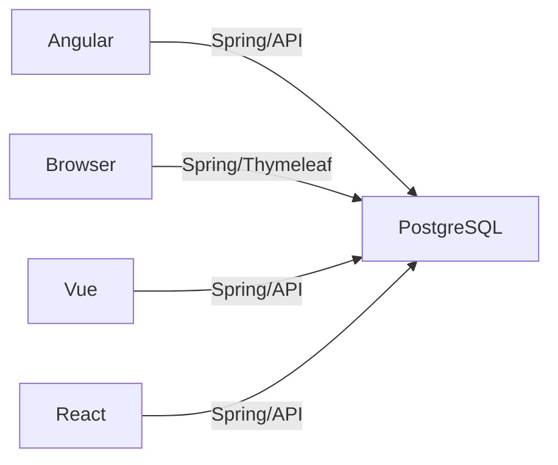
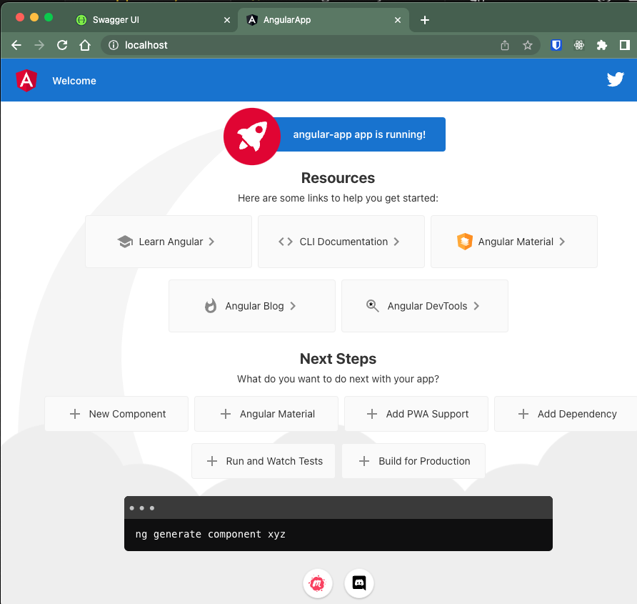
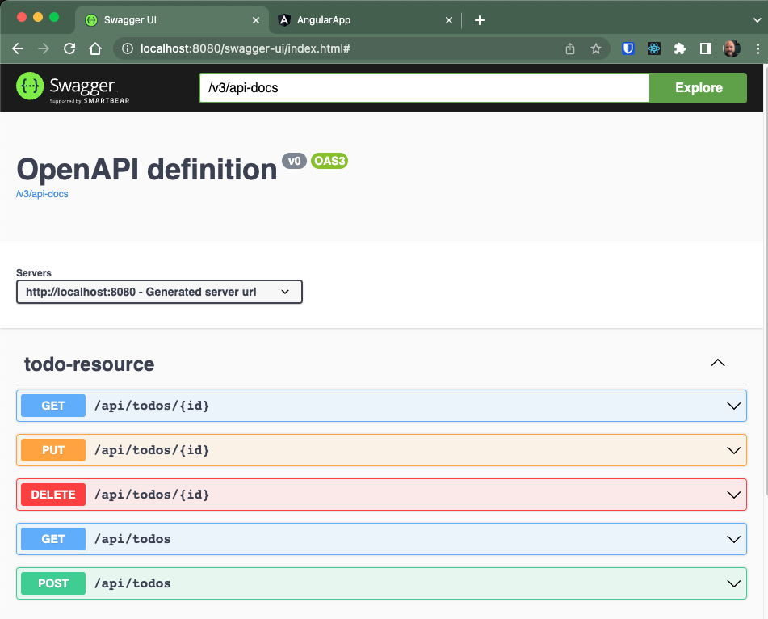

# dceg: Example of using a docker-compose.yml 

## Dream of many example paths


## Usage
```
❯ docker compose up -d # you should see four containers start
```

### See how they are feeling: -- sometimes run `docker compose up -d` to get springboot container running

```
❯ docker ps | nl
     1  CONTAINER ID   IMAGE             COMMAND                  CREATED         STATUS              PORTS                            NAMES
     2  9aa32fb343aa   nginx:latest      "/docker-entrypoint.…"   2 minutes ago   Up 2 minutes        0.0.0.0:80->80/tcp               dceg-nginx-1
     3  6d0d20dcf406   dceg_springboot   "java -jar my-applic…"   2 minutes ago   Up About a minute   0.0.0.0:8080->8080/tcp           dceg-springboot-1
     4  30a0301acfd2   postgres:latest   "docker-entrypoint.s…"   2 minutes ago   Up 2 minutes        0.0.0.0:5432->5432/tcp           dceg-postgres-1
     5  07813487259b   dceg_angular      "/docker-entrypoint.…"   2 minutes ago   Up 2 minutes        80/tcp, 0.0.0.0:4200->4200/tcp   dceg-angular-1
```


## Notice there's a database (created by springboot)

```
❯ docker compose  exec postgres bash
root@30a0301acfd2:/# su - postgres
postgres@30a0301acfd2:~$ psql springbootdb
psql (15.1 (Debian 15.1-1.pgdg110+1))
Type "help" for help.

springbootdb=# select * from todo;
 id | completed | date_created | item | last_updated
----+-----------+--------------+------+--------------
 10000 | f         | 2023-06-21 02:33:24.063316+00 | sleep | 2023-06-21 02:33:24.063316+00
(0 rows)

springbootdb=# exit
postgres@30a0301acfd2:~$ exit
logout
root@30a0301acfd2:/# exit
exit
```

## Most ports exposed -- that's bad -- and handy

### Angular
Since nginx is serving on port 80, http://localhost shows this:


### Spring boot swagger 
Since 8080 is exposed outside the docker compose network, http://localhost:8080/swagger-ui/index.html shows this:



